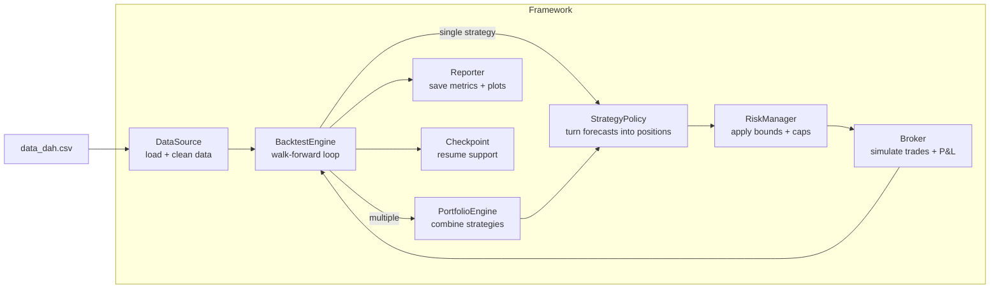

# DESIGN_NOTES.md

**Day-Ahead Hourly (DAH) Trading Framework, Design Notes**

Hi Dan & team! Here’s how I approached the challenge: architecture and framework focused. I kept it intentionally lightweight, but the bones are strong enough to scale.

This document covers:

- What the framework does and why it’s structured this way
- Data contracts & leakage guards
- Walk-forward loop (single strategy vs. portfolio)
- Positioning, constraints, and P&L
- Reporting and reproducibility
- Resume-from-checkpoint (operability)
- Testing & CI
- How to run (baseline / ridge / portfolio)

If you’d like to go straight to the “how to run,” jump to the last section.

## 1) Architecture at a Glance

**Goals**

- **Modular**: models and policies can be swapped in and out with config.
- **Leak-free**: models only see past data, never today or the future.
- **Risk-aware**: per-hour bounds and a daily cap, with logs when limits are hit.
- **Operable**: clear outputs (metrics, plots, summaries, logs) and simple resume support.

**Main parts**

- **DataSource**: reads the CSV, converts times to UTC, applies the `end_now` cutoff, builds the `(entry_time, hour)` index, and only keeps features known at entry (wind/solar/load forecasts).
- **SignalModel**: `fit(past)`, `predict(today)` -> 24 values.
  - _Baseline_: uses yesterday’s hourly premium as today’s forecast.
  - _Ridge_: ridge regression with a small regularization term for stability.
- **StrategyPolicy**: maps predictions to positions.
  - _SignPolicy_: takes the sign of the forecast and trades max size.
  - _LinearScalerPolicy_: scales by signal size, ignores tiny/noisy signals.
- **RiskManager**: enforces per-hour and daily caps; logs when positions are clipped or scaled.
- **Broker**: simulates trades with entry/exit prices, applies costs, and computes hourly then daily P&L.
- **BacktestEngine**: runs the day-by-day walk-forward loop; splits past vs today correctly; handles DST; supports single or multiple strategies; supports resume.
- **Reporter**: writes metrics to JSON, plots cumulative P&L, and generates Markdown/HTML summaries (with IS vs OOS split if set). Also snapshots config and handles empty runs.

**High-level flow**



## 2) Data Contract & Leakage Guards

**UTC times**  
All times are converted to UTC so filtering by `end_now` is consistent. Daylight savings is handled by using whatever hours actually exist that day (sometimes 23 or 25).

**Features**  
Only forecasts that would be known at entry are kept:

- `wind_forecast_*`
- `solar_forecast_*`
- `load_forecast_*`

Other columns (like prices and labels) are ignored when training models.

**Indexing**  
Data is indexed by `(entry_time, hour)` and includes a `premium = exit_price - entry_price` column, sorted in time order. I did this to keep the walk-forward split clean and avoids leakage.

## 3) Walk-Forward Backtest (Chronological & Day-Ahead)

**How it works**  
Each day around the entry time (11:50), we act as if we are making trading decisions for the **next day’s 24 delivery hours**. To keep it realistic:

- **Past data only**: the model is fit on all data strictly before that entry time.
- **Today’s decision set**: the model then predicts the premiums for the 24 hours of the next day.
- **Out-of-sample**: this ensures every prediction is made without seeing the outcomes of that day, just like it would be in production.

**Single strategy**

1. Fit the model on past data
2. Predict hourly premiums for the next day
3. Adjust for DST if a day has 23 or 25 hours
4. Map predictions to positions using the policy
5. Apply risk bounds and daily cap
6. Run through the broker to compute P&L for those delivery hours

**Portfolio**  
If multiple strategies are configured:

- Fit all models on past data
- Generate each strategy’s positions for the next day and combine them with weights
- Run the combined positions once through risk checks and broker

Basically the idea is that this loop runs day by day, walking forward through the dataset, so results are day-ahead.

## 4) Positioning, Constraints, Costs

**Policies**

- _SignPolicy_: take the sign of the forecasted premium and trade at the max allowed size.
- _LinearScalerPolicy_: scales positions up or down based on the size of the signal, with a threshold so tiny noisy signals are ignored.

**Risk checks**

- Per-hour limits (default `[-10, +10]`).
- Daily exposure cap
- Logs whenever it clips a position by hour or scales down the whole day to fit the cap.

**Broker**

- Hourly P&L: `position * (exit_price - entry_price) - costs`.
- Costs: both a flat fee and bps cost, charged on entry and exit.
- Daily P&L is just the sum of the hourly P&L.

## 5) Reporting & Reproducibility

**What gets saved** (in `artifacts/<run_id>`):

- `metrics.json`: key stats like days, total P&L, mean, stdev, Sharpe, and drawdown
- `cumulative_pnl.png`: running P&L plot (works headless, fine for CI)
- `summary.md` & `summary.html`: Better looking and readable summaries, with IS vs OOS metrics if a split date is set
- `config.snapshot.yaml`: snapshot of the config so runs can be reproduced
- `run.log`: log of everything during the run, including risk events

**Resume safety**  
If a run is resumed and there are no new days to process, the reporter still writes all artifacts and adds a note that it caught up to `end_now`, rather than failing. I added this to make it safe to use in automated daily runs.

## 6) Resume from Checkpoint (Operability)

For long runs or daily automation, I wanted a way to safely pause and continue without reprocessing everything. The approach is simple:

- After each day, the engine writes a `checkpoint.json` with the last entry time completed.
- On the next run, if `engine.resume: true` is set, any days at or before that point are skipped.
- If there’s nothing new (for example `end_now` hasn’t advanced), the run still writes out artifacts with a note that it caught up.

I first thought about this because I worked on a similar research paper in computer graphics (see [IEEE link](https://ieeexplore.ieee.org/document/9531695)). That project needed reliable restart points for long computations, and I applied the same idea here to make backtests more robust.

## 7) Testing & CI

**Acceptance tests (given in the repo)**

- Check that models never see future data
- Make sure per-hour limits and daily caps are enforced
- Verify broker math and cost handling

**Unit tests (I added)**

- DataSource: whitelist rules and `end_now` cutoff
- RiskManager: clipping logic and idempotence
- Broker: linearity and daily P&L sums
- Reporter: handles empty runs (resume caught up)
- PortfolioEngine: weighted combination works as expected
- Engine resume: first run processes days, second run skips correctly

**CI**  
A simple GitHub Actions workflow runs `pytest -q` on every push. This keeps the checks automatic and the repo clean.

## 8) How to Run (and What to Expect)

**Setup**

```bash
python -m venv .venv && source .venv/bin/activate
pip install -e .
python -m pytest -q
```

**Baseline**

```bash
python cli.py backtest --config configs/baseline.yaml
# artifacts/baseline/...
# Expect: baseline can be flat in some windows (as designed).
```

**Ridge**

```bash
python cli.py backtest --config configs/ridge.yaml
# artifacts/ridge/...
# Expect: non-flat P&L; Sharpe printed in metrics/summaries; clipping logs in run.log
```

**Portfolio (two strategies)**

```bash
python cli.py backtest --config configs/portfolio.yaml
# artifacts/portfolio/...
# Combined targets -> risk -> broker once
```

**Portfolio (three strategies / hyper-params)**

```bash
python cli.py backtest --config configs/portfolio_three.yaml
# artifacts/portfolio_three/...
# Shows extensibility via YAML-only tuning and improved total P&L.
```

**Resume**

```bash
python cli.py backtest --config configs/portfolio_resume.yaml
# artifacts/portfolio_resume/checkpoint.json is updated per day
# Second run (same end_now) will skip and still write valid artifacts.
```

**Tuning knobs**

- Policy: `scale`, `threshold`
- Risk: `per_hour_bounds`, `daily_abs_cap`
- Costs: `fee_per_mwh`, `bps_per_trade`
- Reporter: `report.split_date` (for IS vs. OOS table)
- Engine: `start`, `end`, `end_now`, `resume: true`

## 9) Why this works (and how I’d extend it)

I kept this architecture and framework practical and easy to work with:

- **Modular**: models, policies, and other parts can be swapped through config without touching code.
- **Correct**: walk-forward loop avoids leakage, only uses features known at entry, and handles DST safely.
- **Reliable**: clear logs, reproducible artifacts, and a checkpoint system so runs can be resumed.
- **Tested**: acceptance tests plus unit tests around the trickier parts.

**Next steps I’d add**

- Paper-trading mode to simulate live orders
- SQL data source for direct ingestion
- Lightweight monitoring to track P&L and risk in real time

## Appendix: File Map (for reviewers)

- **cli.py** : CLI driver (`backtest`)
- **configs/**
  - `baseline.yaml`, `ridge.yaml`, `portfolio.yaml`, `portfolio_three.yaml`, `portfolio_resume.yaml`
- **src/**
  - `data/datasource.py` - UTC/whitelist/`end_now` → `(entry_time, hour)`
  - `models/baseline.py`, `models/ridge.py`
  - `strategy/baseline.py`, `strategy/linear_scaler.py`
  - `risk/manager.py` : bounds + daily cap + logs
  - `exec/broker.py` : fills, costs, hourly/daily P&L
  - `engine/backtest_engine.py` : walk-forward, portfolio, resume, DST-safe
  - `engine/portfolio.py` : multi-strategy combine
  - `metrics/reporter.py` : JSON/PNG/MD/HTML, IS vs. OOS, empty-run safe
  - `utils/checkpoint.py`, `utils/config.py`, `utils/calendar.py`, `utils/logging.py`
- **tests/**
  - acceptance: leakage, bounds, P&L
  - unit: datasource whitelist, risk logs/idempotence, broker linearity, reporter empty, portfolio combine, engine resume smoke

Thanks for reading, happy to walk through the decisions and extend any part of this with you.
